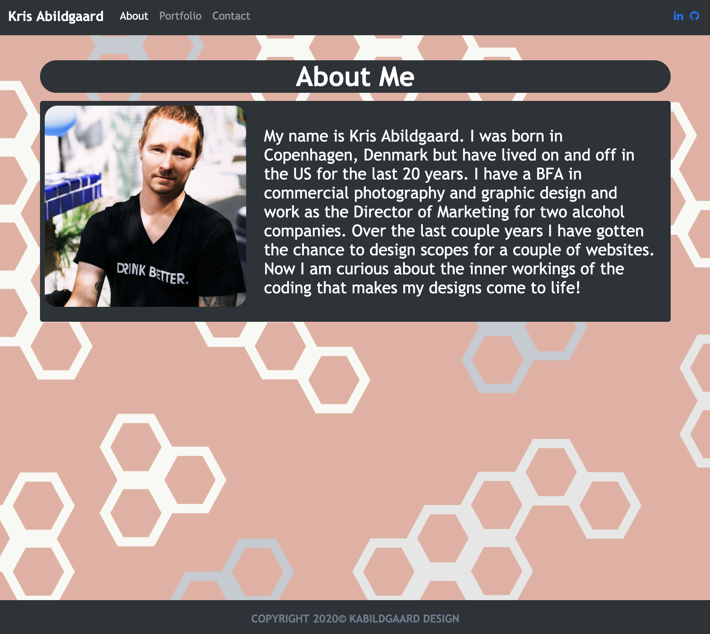

Name: # Personal Portfolio

Description:

Badges:

Visuals:

Installation:

    Created on Mac OS
    HTML
    CSS
    Bootstrap
    Font Awesome

Usage:

Support:

    No Support at this time.

Roadmap:

Contributing:

    Open

Authors and acknowledgment:

License:

    Open

Project status:

    Finished for now...

Project links:

[The URL of the functional, deployed application](https://kabildgaard.github.io/Portfolio/)

[The URL of the GitHub repository](https://github.com/KABILDGAARD/Portfolio)

